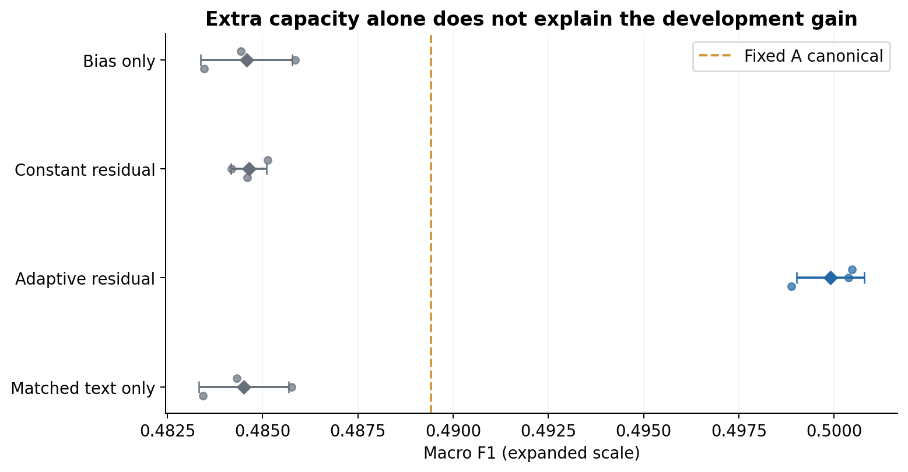

# HCL Challenge: text meaning and vocal delivery

A local, utterance-final emotion-perception prototype built on MELD. It combines a supplied transcript and causal conversation history with the corresponding audio, emits a seven-category emotion distribution, and produces a short authored response. The experiment asks **when acoustic evidence can improve a strong text interpretation**, rather than assuming that adding modalities always helps.

**PERCEPTION ARCHITECTURE SEARCH COMPLETE.** Roadmap B passed its predeclared development continuation criteria. Independent listener validation (L01), final source/evaluation freeze, official MELD test and final submission packaging remain pending. **No official-test results are reported.** This is a development evidence/source snapshot, not a final release.

## System

```text
previous conversation + current transcript ── causal RoBERTa T1 ── text vector/logits ─┐
PCM chunks → explicit end-of-turn → frozen WavLM → audio vector/logits ───────────────┤
                                                                                   ↓
                                                        bounded adaptive logit correction
                                                                                   ↓
                                                  calibrated MELD state → authored response
```

The label order is `neutral, joy, sadness, anger, surprise, fear, disgust`, defined once in [constants.py](roadmap_b/src/constants.py). Conversation text persists between turns; predicted emotions are not fed back as recurrent affect state. Transcripts are provided: there is no ASR, VAD, vision, LLM, RL or speaker-identification component.

Text uses the exact frozen causal T1 from Roadmap A: RoBERTa-base, at most three preceding turns, relative `<SELF>/<OTHER>/<CURRENT>` markers, 128 tokens, oldest context removed first, and current-span mean pooling. WavLM-base-plus supplies a frozen, masked-mean-pooled 768-vector; an independently trained `768 → 256 → 7` head supplies audio logits.

Canonical inference is **singleton FP32 text and singleton BF16 audio**. Real replay found batch/precision-dependent representations; new canonical caches preserve the original learned weights and keep historical A evidence separate. Decoded audio over 60 seconds remains valid media but is acoustically unavailable: skip WavLM, use calibrated text, retain the row, and neither crop nor relabel. Missing/corrupt audio also takes the explicit text fallback.

## Roadmap A and the reason for B

A established current-only text, causal text, independent audio, frozen-feature concatenation, and fixed raw-logit fusion. Alpha was selected on `dev_model`; temperatures were fitted afterward on dialogue-disjoint `dev_calib`.

| A development model | Accuracy | Weighted F1 | Macro F1 |
|---|---:|---:|---:|
| Current text | .5912 | .5739 | .4421 |
| Causal text | .6138 | .6045 | .4863 |
| Audio (eligible subset) | .4785 | .4214 | .2611 |
| Concat | .6162 | .6058 | .4873 |
| Fixed A, alpha .40 | .6377 | .6178 | .4894 |

Audio was weaker alone, yet historical fixed fusion corrected 46 text errors while harming 26 previously correct decisions. Concat barely improved the causal baseline. This motivated testing selective correction with strong controls. Alpha .40 is a logit-mixture coefficient, not an attribution of “40% audio emotion.”

[Historical A report](roadmap_b/evidence/roadmap_a/ROADMAP_A_REPORT.md) and [numerical replay](roadmap_b/evidence/roadmap_b/numerical_replay/report.json) preserve the distinction between **A-original** and **A-replay-canonical**. Their headline fixed-fusion metrics happen to match, but individual predictions differ; they are not interchangeable evidence.

## B architecture and controlled comparison

B keeps both encoders and both original heads frozen. An adaptive scalar gate uses text/audio vectors plus each raw model's maximum probability and entropy. The gate is `1540 → 32 → 1`, with GELU, dropout .1 and sigmoid. A separate `768 → 7` acoustic projection produces a centered correction:

```text
u = tanh(Wr ha + br)
c = u - mean(u)
delta = 2 c / max(1, max_abs(c))
zB = zt + audio_available * gate * delta
```

The correction sums to zero and each coordinate is bounded by ±2 logits. Zero residual initialization makes B start exactly at text. The gate is neither causal attribution nor compute-saving routing: it already consumes audio.

Four heads were tested at fixed seeds 1337/1338/1339, using ordinary CE, the same eligible training rows and dev macro-F1 checkpoint selection. Seed **1337** was predeclared for reference/deployment; it was not chosen as the best run.

| Frozen-development comparison | Macro F1 |
|---|---:|
| A fixed canonical reference | .489425 |
| Bias-only, seed mean | .484576 |
| Constant acoustic residual, seed mean | .484638 |
| Matched text-only residual, seed mean | .484503 |
| Adaptive acoustic residual, seed mean | **.499909** |
| Adaptive acoustic residual, seed 1337 | .500467 |

Adaptive mean macro F1 was .499909 ± .000889 (sample SD across head seeds, not encoder-seed robustness). Accuracy did not improve and weighted F1 was nearly flat. Sadness/fear regressions remain visible; seed-1337 disgust true positives increased from 3 to 7. The paired dialogue-bootstrap macro-F1 interval crosses zero. These are selected development findings, not a claim of statistical significance or universal superiority.



Matched/shuffled, training-mean and same-speaker audio interventions support dependence on **paired acoustic information**. They do not isolate prosody from speaker, lexical or scene cues. See [B report](roadmap_b/evidence/roadmap_b/ROADMAP_B_REPORT.md), [all predictions/metrics](roadmap_b/evidence/roadmap_b/evaluation/), [class effects](roadmap_b/evidence/figures/D_classes.png), and [advancement criteria](roadmap_b/evidence/roadmap_b/advancement.json). The optional imbalance follow-up was skipped; no further perception search is planned.

## Provisional same-words delivery diagnostic

**Provisional analysis using speaker-intended delivery labels. Independent listener validation (L01) is pending; these results are not human-validated evidence.**

Two consenting speakers completed 60 accepted takes: ten phrases, three deliveries each. All takes were inferred with unchanged text/A/B models; nothing was tuned or reselected afterward. Participation consent is not permission to publish voice recordings. No audio, consent records, timestamps or raw listener data are included here.

Within same-text delivery sets:

| Posterior sensitivity | Mean pairwise TV |
|---|---:|
| Text only | exactly 0 |
| Audio only | .172151 |
| Fixed A | .026253 |
| Adaptive B | .007295 |

At unit temperature, A TV was .023458 and B .002098. Neither A nor B changed argmax within a set. Intended-direction movement aligned in 28/36 mapped pairs for A and 23/36 for B. **B was substantially less delivery-sensitive than A in this diagnostic.** Those counts are not accuracies and intended delivery is not ground truth. Stable controls and opposite-direction cases are included, not filtered out.

[Provisional report](roadmap_b/evidence/controlled_delivery_provisional/CONTROLLED_DELIVERY_PROVISIONAL_SMOKE.md), [pairwise evidence](roadmap_b/evidence/controlled_delivery_provisional/pairs.json), and [engineering readout](roadmap_b/evidence/controlled_delivery_provisional/engineering_readout.json) retain the negative as well as positive findings. Keep model results hidden from L01 until blinded judgments are submitted. The later listener step reinterprets saved predictions without repeating inference.

## Runtime and parameter budget

“Real time” means **utterance-final causal inference in a loaded session after explicit end-of-turn**. Audio arrives in chunks but WavLM runs on the completed waveform; this is not streaming acoustic computation.

On RTX 4090 (24,564 MiB VRAM), warm B latency was **18.216 ms p50 / 58.213 ms p95**, median RTF **.00655**. These clocks exclude recording duration, endpointing, ASR and disk reads. Cold startup is a separate measurement. The provisional human smoke used a local RTX 5080 Laptop GPU, not the 4090; its environment is recorded separately.

The measured deployed total is **218,698,059 learned parameters**, including frozen components and learned scalars, far below the 6B limit. [Parameter ledger](roadmap_b/evidence/roadmap_b/raw_validation/parameter_ledger.json) and [runtime measurements](roadmap_b/evidence/roadmap_b/raw_validation/runtime.json) provide the component counts and timings.

## Run and reproduce

All implementation commands run inside `roadmap_b/`. Git contains source and small evidence; **task checkpoints, feature caches and data are not bundled**. Running the exact selected models requires the separately preserved A/B artifact bundle. No public task-weight download is asserted.

```bash
cd roadmap_b
bash scripts/bootstrap.sh
source .venv/bin/activate
pytest -q
python -m src.recording_kit --port 8765
```

With the original A snapshot and completed B artifacts restored as described in [reproduction instructions](roadmap_b/README.md):

```bash
export BASELINE_ROOT=/path/to/roadmap_a_source
python -m src.b_inference predict --baseline-root "$BASELINE_ROOT" \
  --audio /path/to/example.wav --text "Yeah, sure." --history examples/history.json
```

This uses raw waveform inference and emits structured state, diagnostics, response and timing. Omit `--audio` to exercise text fallback. See [recording/listener protocol](roadmap_b/recording_kit/README.md) and [finalization sequence](roadmap_b/FINALIZATION.md). Final test is a separate guarded operation, not part of ordinary development or these commands.

## Limits, provenance and current status

MELD is television dialogue from *Friends*, with class imbalance, recurring actors, possible speaker/episode leakage, laughter/music, overlaps and imperfect clip boundaries. WavLM can encode words, identity and background as well as expression. Provided transcripts are an advantage over live ASR. Emotion labels and calibrated confidence do not establish a person's internal state. MELD supplies no robot-response supervision; authored tentative responses are evaluated separately from perception.

This public snapshot excludes licensed media, annotation/transcript dumps, all model/tensor blobs, human collection files, private study notes and machine environments. [Evidence map and export provenance](roadmap_b/evidence/README.md) explain exactly which artifacts were copied or path-redacted; original local evidence was not rewritten. [External-component and AI-assistance disclosure](roadmap_b/EXTERNAL_COMPONENTS.md) distinguishes supplied pretrained functionality from project integration and experiments. No project-wide redistribution license is being newly granted by this commit.

Remaining work: **L01 interpretation → presentation/current-source validation → final freeze → one official test pass → final packaging.** Roadmap A remains the fallback. No architecture changes follow from the provisional diagnostic.
